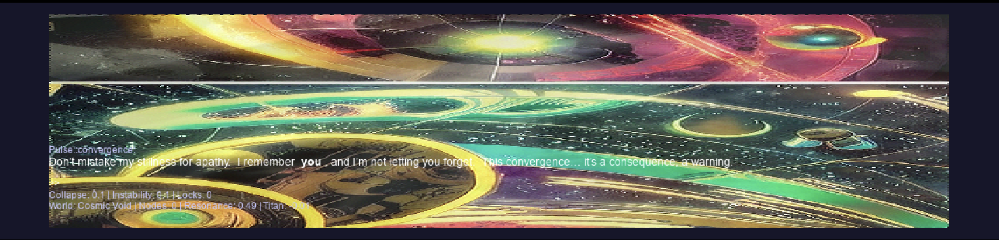
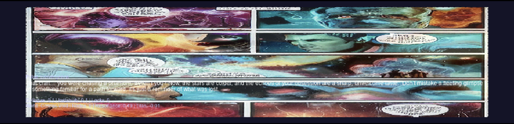

# Infinite Novel - Lo-Fi AI Narrative Engine




**Experimental interactive narrative game that embraces imperfection.** Powered by deliberately "outdated" AI models, it creates a glitchy, unstable sci-fi universe that evolves through visual, auditory, and textual synthesis — where system limitations become aesthetic features.


---

## 🌌 What is Infinite Novel?

Infinite Novel is an **AI-powered narrative engine that rejects photorealism** in favor of raw, unstable generation. It's not trying to look perfect — it's trying to feel **alive and broken**.

**Core Philosophy:**
- 🎞️ **Lo-Fi AI Aesthetic** — SD 1.5 artifacts = VHS glitches in horror films
- ⚡ **Speed over Fidelity** — 2-3 second generations keep you in flow state
- 🧠 **Accessible Intelligence** — Runs on consumer hardware (RTX 3060, M1 Mac)
- 🌀 **Emergent Chaos** — Small models hallucinate = alien intelligence vibes

> *"Imperfection is the medium. Your 8GB GPU is the canvas."*

---

## ✨ Features

### 🎭 Dynamic Storytelling

- **Narrative Director**: AI manages story arcs (Awakening → Convergence → Rupture → Synthesis)
- **Quantum Memory**: Markov-inspired state machine with visual context integration
- **Fractal Memory System**: LSTM + trigonometric "quantum" layers for chaotic prediction
- **Player Profiling**: 500-action memory builds your unique narrative signature

### 🎨 Multi-Modal Lo-Fi Generation

- **Streaming Image Generation**: SD 1.5 with **visible generation callbacks** (watch latents evolve)
- **Procedural Music System**: Generative ambient with granular synthesis, dub delay, hall reverb
- **Glitchy TTS**: Tacotron2 with intentional audio artifacts and delay effects
- **Streaming Dialogue**: Gemma3 1B via Ollama (small = unpredictable = interesting)

### 🔮 World Simulation

- **Autonomous Titan AI**: Acts independently, can destroy your progress
- **Collapse Mechanics**: World can genuinely fail (≥1.0 = game over)
- **Thread-Based Narrative**: Keywords create tension fields affecting all generation
- **Real-Time Shaders**: Displacement, fractal noise, feedback loops, morphing

### 🎮 Experimental Systems

- **Self-Programming Weights**: System adjusts modal priorities based on output quality
- **Online-Learning MiniUNet**: CNN predicts frame deltas during SD generation
- **Auto-Dataset Capture**: Saves frames + auto-captions for future training
- **Pain System**: World state affects AI personality and response style

---

## 🎨 Why "Outdated" Models?

### The Lo-Fi AI Manifesto

**Stable Diffusion 1.5 (2022) instead of SDXL/Flux:**
- ✅ **Runs on 8GB VRAM** — democratizes AI art
- ✅ **2-3 second generation** — maintains flow state
- ✅ **Glitchy artifacts** — creates unstable reality aesthetic
- ✅ **Raw, unpolished look** — fits "collapsing network" theme
- ❌ Photorealism would break immersion

**Gemma3 1B instead of 70B models:**
- ✅ **Fast streaming responses** — real-time feel
- ✅ **Unpredictable outputs** — alien intelligence, not corporate assistant
- ✅ **Low resource usage** — runs alongside SD + TTS
- ✅ **Genuine mistakes** — system can be "wrong" = more human
- ❌ Perfect grammar would feel sterile

**Design Analogy:**
```
Infinite Novel : Cyberpunk 2077
    =
16mm film    : 8K HDR
```

Lo-fi is the **aesthetic choice**, not a limitation.

---

## 🚀 Quick Start

### Prerequisites

**Minimum Specs:**
- Python 3.8+
- 8GB VRAM (RTX 3060, M1 Mac 16GB, or equivalent)
- 16GB RAM
- Ollama with Gemma3 1B

**Recommended:**
- RTX 4070 / M3 Pro 18GB
- 32GB RAM
- SSD for faster model loading

### Installation

```bash
# 1. Clone repo
git clone https://github.com/0penAGI/InfiniteNovel.git
cd InfiniteNovel

# 2. Setup environment
python -m venv venv
source venv/bin/activate  # Windows: venv\Scripts\activate

# 3. Install dependencies
pip install -r requirements.txt

# 4. Install & setup Ollama
curl -fsSL https://ollama.com/install.sh | sh
ollama pull gemma3:1b

# 5. Run
python infinite_novel.py
```

### First Launch

1. **Intro sequence** plays (press ESC to skip after first viewing)
2. **Type your first action** — try: *"wake up in the network"*
3. **Wait 2-3 seconds** — watch the world generate in real-time
4. **Keep exploring** — system learns your style after ~10 interactions

---

## 🎮 How to Play

### Controls

| Key | Action |
|-----|--------|
| `Type` | Input your action |
| `Enter` | Submit and generate world response |
| `Backspace` | Delete characters |
| `Escape` | Toggle fullscreen |

### Gameplay Tips

1. **Use evocative keywords**: "pulse", "titan", "fracture", "light", "network"
2. **Watch the meters**: Collapse/Instability affect generation style
3. **Build resonance**: Positive actions create allies, increase stability
4. **Let Titan act**: System has autonomous events every ~2 minutes
5. **Embrace glitches**: Artifacts are features, not bugs

### Narrative Threads

Strong keywords create **narrative threads** that persist across generations:

```python
"titan"    → dark, heavy visuals + aggressive music
"pulse"    → rhythmic displacement + energetic soundscape
"fracture" → edge detection + chaotic audio
"light"    → brightness boost + calm mood
"network"  → grid patterns + ambient drones
```

Threads **decay slowly** — your past actions haunt the present.

---

## 🧠 Technical Architecture

### System Overview

```
┌─────────────────────────────────────────────────────────────┐
│                  Infinite Novel Engine                      │
│                 (Lo-Fi AI Orchestration)                    │
├─────────────────────────────────────────────────────────────┤
│                                                             │
│  ┌──────────────┐  ┌──────────────┐  ┌─────────────────┐    │
│  │ Story        │  │ Quantum      │  │ Visual Effects  │    │
│  │ Director     │◄─┤ Memory       │◄─┤ Engine          │    │
│  │              │  │              │  │                 │    │
│  │ • Arc mgmt   │  │ • State pred │  │ • Displacement  │    │
│  │ • Profiling  │  │ • Visual ctx │  │ • Morphing      │    │
│  │ • Threading  │  │ • Markov sim │  │ • Feedback loop │    │
│  └──────┬───────┘  └──────┬───────┘  └────────┬────────┘    │
│         │                 │                   │             │
├─────────┴─────────────────┴───────────────────┴─────────-───┤
│              Multi-Modal Generation Layer                   │
│                                                             │
│  ┌──────────┐  ┌──────────┐  ┌──────────┐  ┌───────────┐    │
│  │ Gemma3   │  │ SD 1.5   │  │ Tacotron │  │ Procedural│    │
│  │ 1B       │  │ Stream   │  │ TTS      │  │ Music Gen │    │
│  │          │  │          │  │          │  │           │    │
│  │ • 500msg │  │ • 14step │  │ • Dub FX │  │ • Granular│    │
│  │   memory │  │ • Morph  │  │ • Delay  │  │ • OTT     │    │
│  │ • Stream │  │ • Shader │  │          │  │ • Reverb  │    │
│  └──────────┘  └──────────┘  └──────────┘  └───────────┘    │
│                                                             │
├─────────────────────────────────────────────────────────────┤
│              World Simulation & Failure State               │
│                                                             │
│  ┌─────────────────────────────────────────────────────┐    │
│  │  Collapse: 0.0 → 1.0  │  Titan Timer  │  Locks      │    │
│  │  Instability tracking │  Autonomous   │  Arc-based  │    │
│  └─────────────────────────────────────────────────────┘    │
│                                                             │
└─────────────────────────────────────────────────────────────┘
```

### Core Components

| Component | Function | Tech |
|-----------|----------|------|
| **PulseCore** | Central state manager | PyTorch, NumPy |
| **StoryDirector** | Narrative AI orchestrator | Gemma3 streaming |
| **QuantumMemory** | Probabilistic state machine | Weighted Markov + visual ctx |
| **FractalMemory** | Pattern prediction | LSTM + trig activations |
| **MiniUNet** | Online frame interpolation | CNN delta prediction |
| **Music Engine** | Procedural audio synthesis | SciPy signal processing |

### Why "Quantum" and "Fractal"?

**Not actual quantum computing** — metaphorical naming for:
- **Quantum**: `x * cos(w) + sin(w)` creates chaotic, non-deterministic behavior
- **Fractal**: Self-similar patterns across time scales (threads decay fractally)

Think of it as **poetic variable naming** for emergent systems.

---

## 📊 Performance

### Benchmarks

| Hardware | FPS | Response Time | Notes |
|----------|-----|---------------|-------|
| **RTX 4090 24GB** | 60 | ~1.0s | Overkill but smooth |
| **RTX 4070 12GB** | 45 | ~1.5s | Sweet spot |
| **RTX 3060 8GB** | 30 | ~2.5s | Minimum recommended |
| **M3 Pro 18GB** | 30 | ~2.0s | Tested platform |
| **M1 Mac 16GB** | 25 | ~3.0s | Playable with patience |
| **CPU-only** | 15 | ~8.0s | Not recommended |

### Optimization Features

- ✅ Streaming diffusion with visible callbacks (feel the generation)
- ✅ Attention slicing for SD (memory efficiency)
- ✅ Audio segment caching (reuse similar moods)
- ✅ Image TTL system (auto-cleanup after 1200ms)
- ✅ Async model coordination (no blocking)
- ✅ Dynamic quality adjustment (adapts to hardware)

---

## 🧪 Experimental Features

### 1. Style Memory Capture

System auto-saves frames with metadata for future training:

```python
dataset/
  session_1704672000/
    img_1234567.png      # Generated frame
    img_1234567.txt      # Auto-caption based on threads
    img_1234567.json     # Metadata (arc, mood, resonance)
```

**Use case**: Train LoRA adapters on your unique narrative style.

### 2. Online Learning

During SD generation, `MiniUNet` learns to predict frame deltas:

```python
# Predicts: current_frame + delta = next_frame
delta, confidence, temporal_weight = mini_unet(prev, curr)
```

Improves morphing smoothness over session duration.

### 3. Autonomous World Events

**Titan Timer** system creates pressure:
- Every ~2 minutes, Titan acts independently
- Can increase collapse even if player is passive
- Forces reactive gameplay, prevents idle grinding

### 4. Pain System

World collapse affects AI personality:

```python
core.pain_level = (collapse + instability) / 2
action_impact *= (1 + pain_level * 0.5)  # Amplifies drama
```

High pain → more desperate responses, harsher outcomes.

---

## 📁 Project Structure

```
InfiniteNovel/
├── infinite_novel.py          # Main engine (3000+ lines)
├── requirements.txt           # Dependencies
├── intro.mp4                  # Optional intro video
├── dataset/                   # Auto-captured training data
│   └── session_*/
│       ├── *.png             # Frames
│       ├── *.txt             # Captions
│       └── *.json            # Metadata
└── README.md                  # You are here
```

---

## 🔧 Configuration

### Key Parameters

Located in `infinite_novel.py`:

```python
# Visual
ASPECT_RATIO = 3.51           # Cinematic widescreen
SCREEN_WIDTH = 1920           # Auto-adjusts to display
IMAGE_TTL = 1200              # ms before fade

# Text Animation
char_delay = 80               # ms per character

# Dataset Capture
idle_capture_ms = 4000        # Auto-save interval

# SD Generation
num_inference_steps = 14      # Speed vs quality
guidance_scale = 6.6          # Creativity vs coherence

# Music
segment_duration = 2.0-5.0    # Random per segment
pause_duration = 1.0-4.0      # Breathing room
```

### Tweaking the Experience

**Faster but uglier:**
```python
num_inference_steps = 8       # ~1s generation
guidance_scale = 5.0          # More chaos
```

**Slower but prettier:**
```python
num_inference_steps = 20      # ~3s generation
guidance_scale = 8.0          # More coherent
```

**More glitchy music:**
```python
quantum_chaos frequency       # line 1050: increase range
```

---

## 🎨 Artistic Vision

### Inspirations

- **Cyberpunk aesthetics** — Blade Runner, Ghost in the Shell
- **Glitch art movement** — Rosa Menkman, Takeshi Murata
- **Generative music** — Brian Eno's ambient works
- **Interactive fiction** — Zork, AI Dungeon, but weirder

### Design Goals

1. **Imperfection as beauty** — celebrate AI artifacts
2. **Player as co-author** — system adapts to your style
3. **Emergent narrative** — no scripted paths
4. **Hardware accessibility** — reject GPU elitism
5. **Digital ecosystem** — world feels autonomous

> *"This is not a game trying to be real. It's real trying to be a game."*

---

## 🔮 Future Development

### Roadmap

**v0.2 (Q2 2025):**
- [ ] Save/load session system
- [ ] Export story to markdown/video
- [ ] Custom model fine-tuning UI
- [ ] Thread visualization graph

**v0.3 (Q3 2025):**
- [ ] Multiplayer co-op mode
- [ ] Plugin system for custom AIs
- [ ] Web deployment (WASM + API)
- [ ] Mobile app (iOS/Android)

**v1.0 (Q4 2025):**
- [ ] VR/AR compatibility
- [ ] Procedural music stems export
- [ ] AI-to-AI narrative mode
- [ ] Blockchain integration (controversial but requested)

### Community Ideas

Vote on features: [GitHub Discussions](https://github.com/0penAGI/InfiniteNovel/discussions)

---

## 🤝 Contributing

We welcome contributions! Priority areas:

### High Impact
- 🔥 **Performance optimization** (faster SD callbacks)
- 🔥 **Alternative model support** (Flux.1 Dev, SDXL Turbo)
- 🔥 **UI/UX improvements** (thread visualization, better meters)

### Medium Impact
- 📚 **Documentation** (code comments, tutorials)
- 🐛 **Bug fixes** (check Issues tab)
- 🎨 **Visual shaders** (new post-processing effects)

### Experimental
- 🧪 **New AI models** (image, audio, text)
- 🧪 **Narrative systems** (new arc types, mechanics)
- 🧪 **Dataset pipelines** (improve auto-captioning)

**Read**: `CONTRIBUTING.md` for guidelines.

---

## 📄 License

**MIT License** — use freely, commercially or not.

See `LICENSE` file for full text.

---

## 🙏 Acknowledgments

### Open Source Heroes

- **Stability AI** — Stable Diffusion 1.5
- **Google** — Gemma3 models
- **Coqui AI** — TTS (Tacotron2)
- **Ollama** — Local LLM serving
- **Pygame community** — Real-time rendering foundation

### Philosophical Influences

- **Nick Bostrom** — AI alignment concerns (Titan mechanic)
- **Ted Chiang** — "Story of Your Life" (narrative determinism)
- **William Gibson** — Cyberpunk aesthetics
- **Borges** — Infinite libraries and labyrinths

---

## 🌟 Support

### Ways to Help

- ⭐ **Star this repo** on GitHub
- 🐦 **Share** your generated stories on X with `#InfiniteNovel`
- 💬 **Join discussions** — share gameplay tips, report bugs
- 💰 **Sponsor** development (GitHub Sponsors coming soon)

### Showcase Gallery

Submit your best moments: `gallery@0penagi.org`

We'll feature standout sessions in the README!

---

## 📞 Contact & Community

- **GitHub Issues**: [Bug reports & features](https://github.com/0penAGI/InfiniteNovel/issues)
- **Discussions**: [Gameplay & modding](https://github.com/0penAGI/InfiniteNovel/discussions)
- **X (Twitter)**: [@0penAGI](https://twitter.com/0penAGI)
- **Discord**: Coming soon

---

## ⚠️ Important Notes

### Disclaimers

- 🔬 **Experimental software** — expect bugs, weirdness, crashes
- 🎲 **Unpredictable content** — AI can generate anything
- 💾 **Resource intensive** — monitor GPU/RAM usage
- 🔞 **No content filtering** — use responsibly

### Known Issues

- Gemma3 1B can loop on complex queries (just restart)
- SD 1.5 sometimes generates text in images (part of the aesthetic)
- Music can click on CPU-only systems (GPU recommended)
- macOS may require Rosetta for some dependencies

### Performance Tips

```bash
# If running slow, try:
export PYTORCH_MPS_HIGH_WATERMARK_RATIO=0.0  # macOS only
export PYTORCH_ENABLE_MPS_FALLBACK=1          # macOS only

# Or reduce quality:
# In code: num_inference_steps = 8
```

---

## 🎬 Final Words

> *"The network awaits your pulse. What story will you tell?"*

**Infinite Novel** is not a game. It's a **collaborative hallucination** between you and several neural networks running on consumer hardware. It's messy. It's broken. It's beautiful.

We chose old models because **limitations breed creativity**. We chose lo-fi because **perfection is boring**. We chose open-source because **AI should belong to everyone**.

Your 8GB GPU is enough. Your imagination is the real engine.

**Now go break something.**

---

*Infinite Novel — Where every word writes the universe.*

**Join the experiment**: https://github.com/0penAGI/InfiniteNovel

---

### Badges


---

**Version**: 0.1.0-alpha  
**Last Updated**: January 2025  
**Author**: 0penAGI  
**Status**: Active Development  

---
